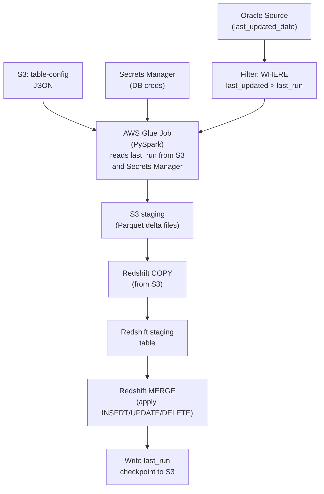
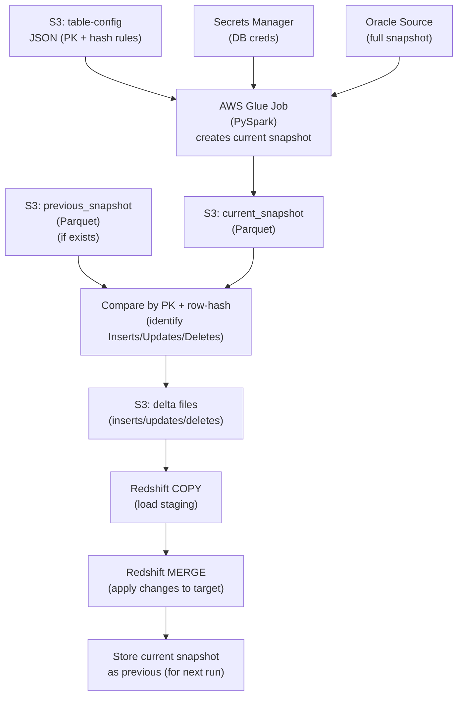

```mermaid
flowchart TD
  %% Option 1: Timestamp-Based Incremental Load (vertical, compact)
  S3Cfg["S3: table-config\nJSON"]
  Secrets["Secrets Manager\n(DB creds)"]
  Oracle["Oracle Source\n(last_updated_date)"]
  Glue["AWS Glue Job\n(PySpark)\nreads last_run from S3\nand Secrets Manager"]
  Query["Filter: WHERE\nlast_updated > last_run"]
  S3Stage["S3 staging\n(Parquet delta files)"]
  COPY["Redshift COPY\n(from S3)"]
  RedshiftStage["Redshift staging\ntable"]
  MERGE["Redshift MERGE\n(apply INSERT/UPDATE/DELETE)"]
  LastRun["Write last_run\ncheckpoint to S3"]

  S3Cfg --> Glue
  Secrets --> Glue
  Oracle --> Query
  Query --> Glue
  Glue --> S3Stage
  S3Stage --> COPY
  COPY --> RedshiftStage
  RedshiftStage --> MERGE
  MERGE --> LastRun
```

```mermaid
flowchart TD
  %% Option 2: Snapshot + Hash Difference (vertical, compact)
  S3Cfg2["S3: table-config\nJSON (PK + hash rules)"]
  Secrets2["Secrets Manager\n(DB creds)"]
  Oracle2["Oracle Source\n(full snapshot)"]
  Glue2["AWS Glue Job\n(PySpark)\ncreates current snapshot"]
  CurrSnap["S3: current_snapshot\n(Parquet)"]
  PrevSnap["S3: previous_snapshot\n(Parquet)\n(if exists)"]
  Compare["Compare by PK + row-hash\n(identify Inserts/Updates/Deletes)"]
  DeltaS3["S3: delta files\n(inserts/updates/deletes)"]
  COPY2["Redshift COPY\n(load staging)"]
  MERGE2["Redshift MERGE\n(apply changes to target)"]
  StoreSnap["Store current snapshot\nas previous (for next run)"]

  S3Cfg2 --> Glue2
  Secrets2 --> Glue2
  Oracle2 --> Glue2
  Glue2 --> CurrSnap
  PrevSnap --> Compare
  CurrSnap --> Compare
  Compare --> DeltaS3
  DeltaS3 --> COPY2
  COPY2 --> MERGE2
  MERGE2 --> StoreSnap
```
